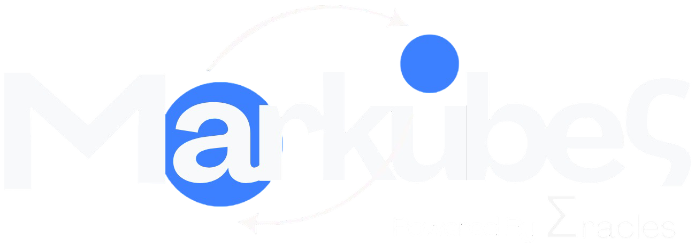

# **Data Driven Software Infrastructure**

*Latam-born, globally minded*

We build **self-adjusting software ecosystems** powered by real-time data — eliminating digital waste and optimizing performance at scale.

---

## Mission

We want to **revolutionize modern web software infrastructure** by pioneering self-adjusting software ecosystems driven by real-time data. Applied on already existing and well-supported software infrastructure, we **eliminate digital waste** and **optimize performance at scale**.

Our mission is to build a **faster, more affordable, and radically green** computing future for the world.

We are deeply proud of being a **Latam-based company**. We want to set an example for our region and become a **leading technology software company** in the world.

---

## What we do

- **Self-adjusting systems** — Markov-chain inspired models that continuously learn from your workloads and adjust infrastructure automatically.
- **Resource optimization** — Across nodes, namespaces and workloads, without sacrificing reliability or performance.
- **Cost reduction** — Plug into the infrastructure you already trust; no rewrites.

### First product: Markubes for Kubernetes

A data-driven optimization layer on top of your existing Kubernetes clusters:

- Resource optimization across nodes, namespaces and workloads  
- Cost reduction with reliability first  
- No rewrites — works with the infrastructure you already use  

---

## Who it's for

| **Companies** | **Engineers** |
|---------------|----------------|
| CTOs, VPs of Engineering and FinOps teams reducing cloud spend | Platform and SRE teams tired of manual tuning |
| Sustainability leaders who care about a greener computing footprint | Engineers who want infrastructure that learns from production data |
| Organizations that want better performance without more operational overhead | Builders who believe Latam can lead the next wave of infrastructure innovation |

---

## Stay close

- **LinkedIn:** [company/markuves](https://www.linkedin.com/company/markuves/)
- **GitHub:** [@Markuves](https://github.com/Markuves)
- **WebSite:** [@Markubes](https://markubes.eracles.com.co/)

---

<strong>Data driven software infrastructure to eliminate digital waste.</strong>

© Markubes

